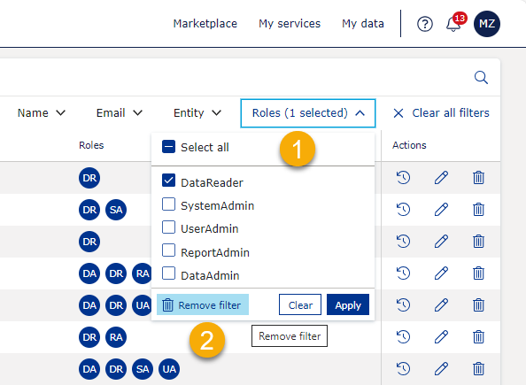
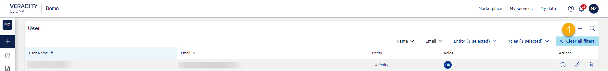
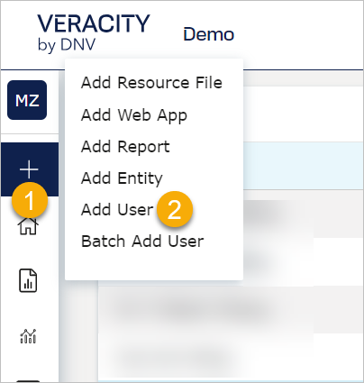
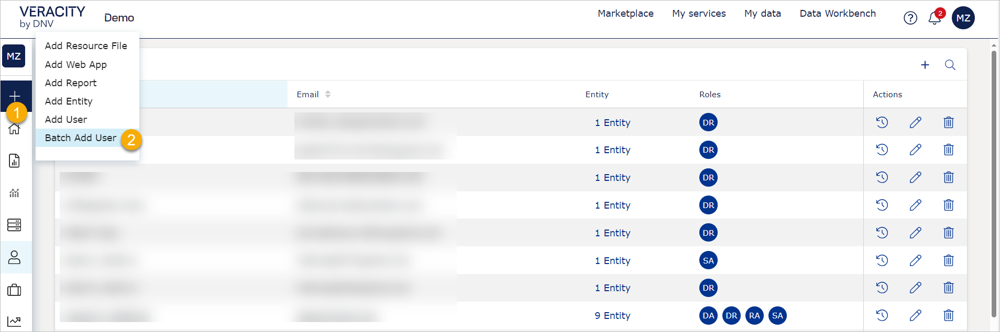
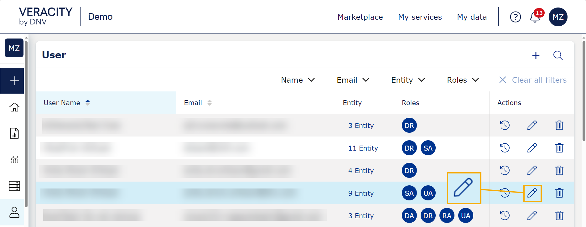
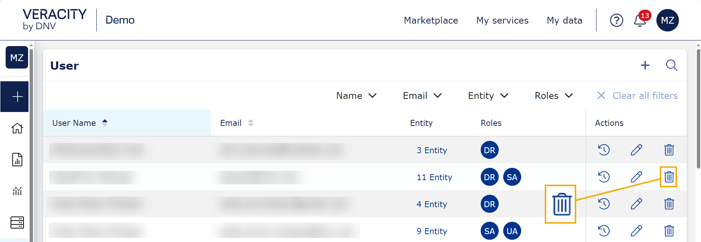
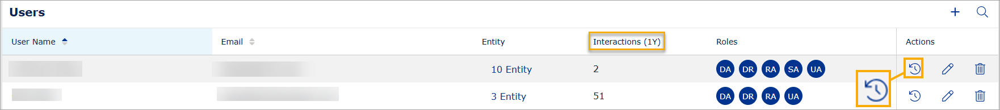

# Users

The 'Users' page shows all users in your VAP service.

## To sort and filter
You can sort the **User Name** and **Email** columns alphabetically. To sort a column, select its name.

To filter users:
1. In the right corner, select the search icon. After this, the following will appear below the search icon: **Name**, **Email**, **Entity**, **Roles**, and **Clear all filters**.
2. To apply a filter, select its name.
3. Enter or select a value by which you want to filter, and select the **Apply** button. You can apply multiple filters.
<figure>
	
</figure>

To remove a filter:
1. Select the name of the filter.
2. Select the garbage can icon with the text **Remove filter**.
<figure>
	
</figure>

To remove all filters, select **Clear all filters**.
<figure>
	
</figure>

To hide a filter, select the search icon.

## To add a user

To add a user to an entity:
1. From the left sidebar, select the plus icon and **Add User**.
2. Enter the user's email address or their unique Veracity ID, and select the **Check** button. If the email address is not associated with a Veracity account, you have to invite this user to create a Veracity account, and after they do it, you can add them to your VAP.
3. Under **Entity List**, select the entity (entities) to which you want to add the user and confirm with the **Add to Entity List** button.
4. Under **Roles**, select one or more [roles](../user-roles.md) for the user. Each role gives different kinds of permissions in your VAP.
5. Optionally, select **Send notification to this user** if you want to notify the user that they have been added to an entity in VAP.
6. To confirm adding the user, select the **Add** button.

<figure>
	
</figure>

## To batch add users
In one batch add, you can import up to 200 users.

To batch-add users to an entity:
1. From the left sidebar, select the plus icon and **Batch Add User**.
2. Under **User Excel File for Batch Add**, select **Upload** to add a CSV file from your local machine to batch import users. In this section, you can also find a template for the file (see the text 'Click here to download the template file').
3. Under **Entity List**, select the entity (entities)  to which you want to add the users and confirm with the **Add to Entity List** button.
4. Under **Roles**, select one or more [roles](../user-roles.md) for the users. Each role gives different kinds of permissions in your VAP.
5. Optionally, select **Send notification to this user** if you want to notify the users that they have been added to an entity in VAP.
6. To confirm adding the users, select the **Add** button.

Note that if you try to add an already existing user, their data (role, entity) will get updated instead.

Note that you can check the status of batch-adding users in the [Background Jobs](background-jobs.md).

<figure>
	
</figure>

## To edit user
To edit a user:
1. In the row with the user's name, in the **Actions** column, select the edit (pencil) icon.
2. Edit the user. You can change the entities they have access to and their roles and notify them about the changes. You cannot change the user email or ID because they come from the user's Veracity account.
3. To confirm the changes, select the **Save** button.

<figure>
	
</figure>

## To delete a user
1. In the row with the user's name, in the **Actions** column, select the garbage can icon.
2. To confirm, select the **Delete** button.

<figure>
	
</figure>

## To see statistics for a user

For each user, you can check the number of their interactions with your entities (year to date) and what they looked at. Also, you can check admin actions taken on this user (for example, create or modify the user). To do so, in the row with the user's name, select the icon shown below.

<figure>
	
</figure>

Here, on the **Admin Operate History** tab, you can also check who upgraded or downgraded a user role. 
* Under **Operate user**, see who upgraded or downgraded a user role.
* Under **Description**, see the names of new and old user roles.
* Under **Date time**, see when the user role was changed.