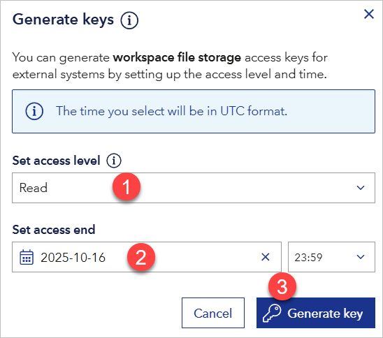

# Create a report using Data Workbench File Storage files and upload it in VAP

You can use files from Data Workbench File Storage in a Power BI report and upload the report in VAP. Start by generating a SAS access token to the file or to a folder.

> For more information about Data Workbench File Storage, [go here](../../dataworkbench/filestorage/filestorage.md).

## To generate an access token for a File Storage file
1. Go to Data Workbench and select the **Data Catalogue** tab.
2. Select **File storage**.
3. In the row with the file, select the three dots menu.
4. Select **Generate keys**.

<figure>
  
</figure>

Then:
1. Under **Set access level**, select **Read**.
5. Under **Set access end**, set a date and time when the access should expire.
6. Select **Generate key**.

<figure>
  
</figure>

Finally, select **Copy key**.
<figure>
  
</figure>

## To generate a SAS token at folder level in File Storage
You can generate a SAS token for an entire folder and use it for all files in that folder.

1. In Data Workbench, open **Data catalogue**.
2. Go to **File storage**.
2. Select the action menu (three dots) on the right.
1. Select **Generate workspace keys**.

Then:
1. Under **Set access level**, select **Read**.
2. Under **Set access end**, set when the access to the folder should expire.
3. Select the **Generate key** button and a new **Access key** section will show.

<figure>
  
</figure>

Finally, select the **Copy key** button to copy the access key. You will use it when connecting to files from that folder in Power BI.

## To use a File Storage file as a data source in a Power BI report
1. Open Power BI Desktop.
2. From the **Home** tab, select **Get Data** and then **Web**.

<figure>
  
</figure>

3. Choose the appropriate option below.

### Using a SAS token for a single file
1. In **From Web**, select **Advanced**.
2. Under **URL parts**:
   - In the upper box, paste the part of the SAS URL that is **before** the `?` character.
   - In the lower box, paste the part of the SAS URL that starts **with** `?`, including `?`.
3. Select **Ok**.

<figure>
  
</figure>

4. In the dialog that appears, select **Ok**.

<figure>
  
</figure>

5. Build visuals and save the `.pbix` file.

> If you have several files, repeat the steps for each file.

**Troubleshooting: "Access to the resource is forbidden"**

Power BI may reuse a cached connection string.

To fix:
1. Go to **File > Options and settings > Data source settings**.
2. Find the data source, right click, and select **Clear Permissions**.
3. Reconnect by entering the correct URL and query parameters.

<figure>
  
</figure>

### Using a folder-level SAS token for multiple files
1. In **From Web**, select **Advanced**.
2. In **URL parts**, paste the folder SAS URL up to and including the folder path, then append the specific filename, for example `.../FolderName/SubFile.csv`.
3. Use the query parameters from the folder SAS token (the part beginning with `?`) for authentication.
4. Repeat for each file you want to load.

## Upload the Power BI file in VAP
1. Open your VAP service.
2. Open Admin Module with a Data, Report, or System Admin role user.
3. From the side menu, select the **+** icon and select **Add Resource File**.
4. Upload your `.pbix` file.
5. If the file uses a **File Storage** data source and this is the **first time** the source is added in this service:
   - Select **Edit** on the uploaded resource.
   - Change **Data Source Sub Type** from `Web` to `DWB File Storage`.
   - Select **Save**.
   - The **Credential** section appears. Paste the SAS token into **Credential**.
   - Select **Update** to apply.
   - Select the **refresh** icon to validate the connection.
   - When you see "Connect to data source successfully", select **Save** again.

> If you skip setting the correct Data Source Sub Type, the token field will not appear and the connection will fail.

6. If the same File Storage source was previously connected in this service:
   - The saved credential is reused.
   - Still change **Data Source Sub Type** to `DWB File Storage` and select **Save**.

7. To update the SAS token later:
   - Select the link or key icon next to the data source.
   - Paste the new token.

8. When the resource file connects successfully, select the **+** icon again and choose **Add Report** to register the report in VAP.

## Enable scheduled refresh in VAP
See the refresh plan details [here](../admin-tab/resource.md).

A scheduled or on-demand refresh will fail if:
* The file structure changed.
* The SAS token expired.
* The file was deleted or the replacement filename does not match.

## Update files in File Storage and refresh in VAP
To update the data used in the report, upload a new version of the file to the **same folder** using the **same filename** to overwrite the old one. 
After that, refresh the resource in VAP (scheduled or manual) to load the new data.