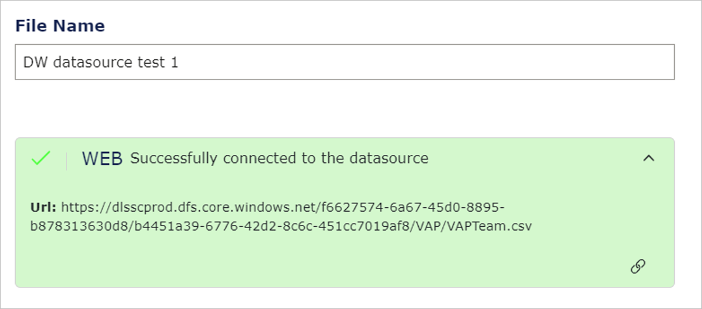

---

# Create a report with a Data Workbench source and upload it in VAP

Follow the steps below to create your report with a Data Workbench File storage.
1. Open Power BI Desktop.
2. From the **Home** tab (1), select **Get Data** (2), and then select **Web** (3).

<figure>
	
</figure>

3. Go to Data Workbench and select the **Data Catalogue** tab (1).
4. Select **File storage** (2).
5. In the **File storage** row, select the three dots menu (3). This will open a dropdown menu with more options.
6. From the dropdown menu, select **Generate keys** (4). This will open a pop-up window where you can generate your key.

<figure>
	
</figure>

7. Under **Set access level**, select **Read** (1).
8. Under **Set access end** set a date far in the future (2). It is important because the report can refresh the data as long as the access key is inside the Set access end period.
9. Select **Generate key** (3). 

<figure>
	
</figure>

10. Select **Copy key** (1) and go to Power BI Desktop.

<figure>
	
</figure>

11. In Power BI Desktop, under **From Web**, select **Advanced** (1).
12. Under **URL parts** (2), paste the access key you just generated in Data Workbench in the following way:
	* In the upper part, paste the part of the access key which is before **?** symbol. Do not include the **?** symbol here.
	* In the lower part, paste the part of the URL which begins with the **?** symbol, including the **?** symbol.
	Note that you can use a parameter to save the access key and URL. To see how to do it, see the section below.
13.	Select **Ok** (3).

<figure>
	
</figure>

14. Then, the information below will display. Select **Ok**.
	
	<figure>
	
</figure>

Below, an example of what your report will look like.

<figure>
	
</figure>

**Note that** if you have several files in the File storage, you must repeat all the steps above for each file.

15. Finally, it is time to build your visuals in the report. Save the file in the storage folder of your choice.

## Use parameter to save access key and URL
You can also use a parameter to save the access key and URL. However, **note that** VAP currently has no user interface for setting the parameter. 

If you still want to use the parameter, follow the steps below.

1. In Power BI Desktop, in the **Home** tab (1), select **Transform data** (2). This will open a dropdown. Select **Transform data** (3).

<figure>
	
</figure>

2. In Power BI Desktop, in the **Home** tab (1), under **Manage Parameters** (2), select **New Parameter** (3).

<figure>
	
</figure>

3. Under **Name**, enter the name of the new parameter (1). Under **Current Value**, enter the default value (2). When you are finished configuring the parameter, select **Ok** (3). Note that the **Required** property should be checked.

<figure>
	
</figure>

4. Now, you can use the parameter which you created before. To do it, in Power BI Desktop, under **From Web**, select **Advanced** (1).
5. Under **URL parts**, select the icon marked in the picture below (2) and select **Parameter** (3).

<figure>
	
</figure>

## Update data in Data Workbench and refresh file to get new data in VAP

To update a file in Data Workbench, ensure that the file you want to upload has the same name as the old one.

Overwrite the existing file in Data Workbench.

New data will be shown in the report in VAP when a scheduled refresh is set up or you trigger an on-demand refresh from VAP Resources.

## Upload Power BI file in VAP

To upload a Power BI File in VAP, follow the steps below.
1. Open your VAP service.
2. Open Admin Module with Data/Report/System Admin role user. This will open a side menu.
3. From the side menu, select the **+** icon and select **Add Resource File**.

<figure>
	
</figure>

4. Specify what is needed and continue using VAP as usual.
5. When the file is uploaded, you will see the information below.

<figure>
	
</figure>

6. If you want to update the access key, after loading the data source, click the link or key symbol. Then, paste the new SAS token you got from the Data Workbench File Storage [in point 10](https://developer.veracity.com/docs/section/vap/file-storage-as-data-source/create-report#use-parameter-to-save-access-key-and-url).
7. Select the **+** icon and select **Add Report**. Then, add a report for the new uploaded file.

For more information, go [here](https://developer.veracity.com/docs/section/vap/admin-tab/resource).

## Enable scheduled refresh on report to get fresh data

To learn more about the Refresh Schedule Plan, go [here](../admin-tab/resource.md).

When a scheduled refresh is set on the data in VAP, fresh data from the report is shown at the intervals you have set. 

**Note that** a scheduled refresh will fail if:
* The file does not have the same file structure as before.
* The access key is no longer valid.
* The file was deleted, or the newly uploaded file does not have the same name.

Enable scheduled refresh or demand refresh on your report.

[Next](update-old-data-source.md)