---
author: Veracity
description: This section describes how to create a report with a Data Workbench source and upload it in VAP
---
---

# Create a report with a Data Workbench source and upload it in VAP
You can use Data Workbench data sets in your VAP report. To do so, start by generating a SAS access token to the data set.

There are two types of data sets you can use as data source:
* Uploaded data sets (find them in Data catalogue > Created data sets, Type: Uploaded); also called structured uploaded data sets.
* Data sets in File storage (find them in Data catalogue > File storage).

## To generate an access token for a structured uploaded data set
You can generate access keys (tokens) from your Data Workbench workspace or via API calls. Note that those access keys must have a date and time when they expire, but you can automatically renew them. For details, check the section [Auto-renew SAS token for Data Workbench structured uploaded data sets](../admin-tab/resource.md).

**Note that** the "Key" generated in Data Workbench is the same as the SAS Token used in VAP. Paste it into the Credential field when editing the resource.

### Using the Data Workbench UI
1. Open your Data Workbench workspace.
1. Navigate to Data Catalogue > Created data sets.
1. Choose an uploaded data set (check in the "Type" column that its type is "Uploaded").
1. Open the data set and in the top-right corner, select **Generate access keys**.
<figure>
	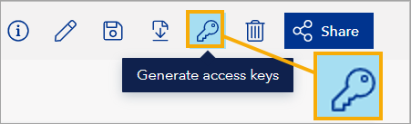
</figure>

After opening the "Generate keys" dialog window:
1. Under **Set access level**, select **Read**.
1. Under **Set access end**, select the date and time when the access should expire.
1. Select the **Generate key** button.
1. Select the **Copy key** button to copy the access token. This is the SAS token that you will use when building a .pbix report.

### With an API call
Call the endpoint `/workspaces/{workspaceId}/datasets/{datasetId}/sas`, [authenticating your API call](https://developer.veracity.com/docs/section/dataplatform/auth) and providing required parameters:
* `{workspaceId}` as UUID
* `{datasetId}` as UUID
* `durationInMinutes` as int32 (how long this data set should be accessible; it can be even five years or longer)
* `type` (set value to `dfs`)

You can check your workspace ID and data set ID by going to your Data Workbench workspace and opening the uploaded data set.
<figure>
	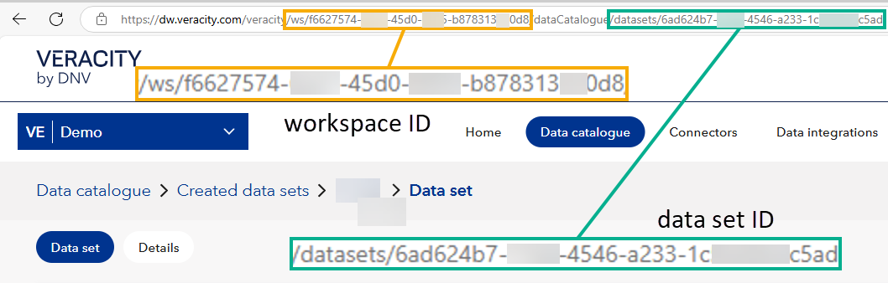
</figure>

Note that this information may get outdated, and the latest information on this endpoint is always available in [Data Workbench API specification](https://developer.veracity.com/docs/section/api-explorer/76904bcb-1aaf-4a2f-8512-3af36fdadb2f/developerportal/dataworkbenchv2-swagger.json).

## To generate an access token for a File Storage data set
1. Go to Data Workbench and select the **Data Catalogue** tab (1).
2. Select **File storage** (2).
3. In the **File storage** row, select the three dots menu (3). This will open a dropdown menu with more options.
4. From the dropdown menu, select **Generate keys** (4). This will open a pop-up window where you can generate your key.

<figure>
	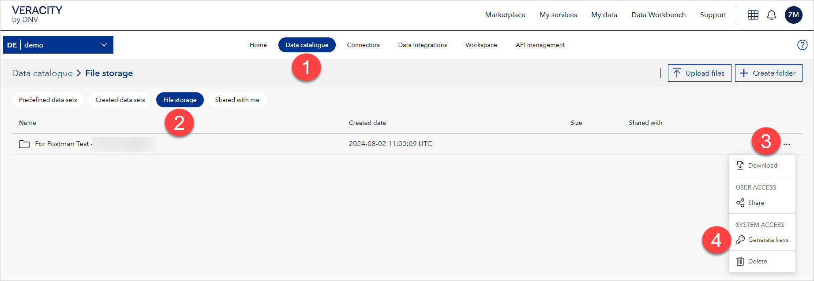
</figure>

5. Under **Set access level**, select **Read** (1).
6. Under **Set access end** set a date far in the future (2). It is important because the report can refresh the data as long as the access key is inside the Set access end period.
7. Select **Generate key** (3). 

<figure>
	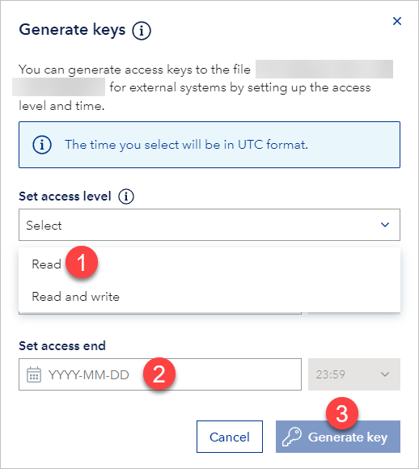
</figure>

8. Select **Copy key** (1).

<figure>
	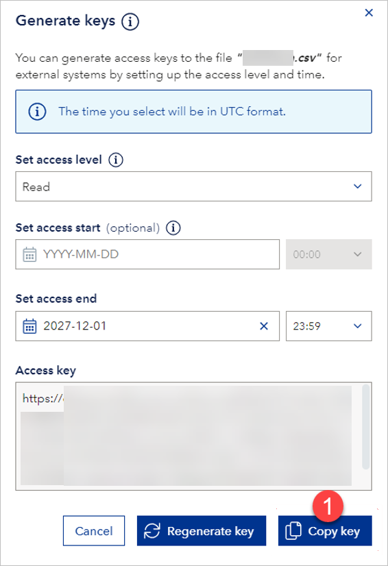
</figure>

## To use a File Storage Data Workbench data set as a source in a VAP report
Follow the steps below to create your report using a File Storage data set from Data Workbench. For uploaded structured datasets, see the section below.
1. Open Power BI Desktop.
2. From the **Home** tab (1), select **Get Data** (2), and then select **Web** (3).

<figure>
	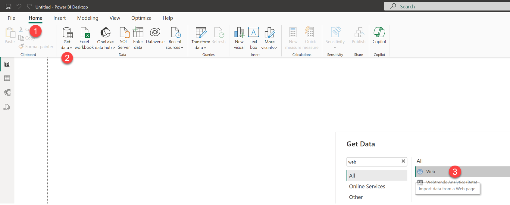
</figure>

3. In Power BI Desktop, under **From Web**, select **Advanced** (1).
4. Under **URL parts** (2), paste the access key (SAS token) you just generated in Data Workbench in the following way:
	* In the upper part, paste the part of the access key which is before **?** symbol. Do not include the **?** symbol here.
	* In the lower part, paste the part of the URL which begins with the **?** symbol, including the **?** symbol.
	Note that you can [use a parameter to save the access key and URL](#use-parameter-to-save-access-key-and-url).
5.	Select **Ok** (3).

<figure>
	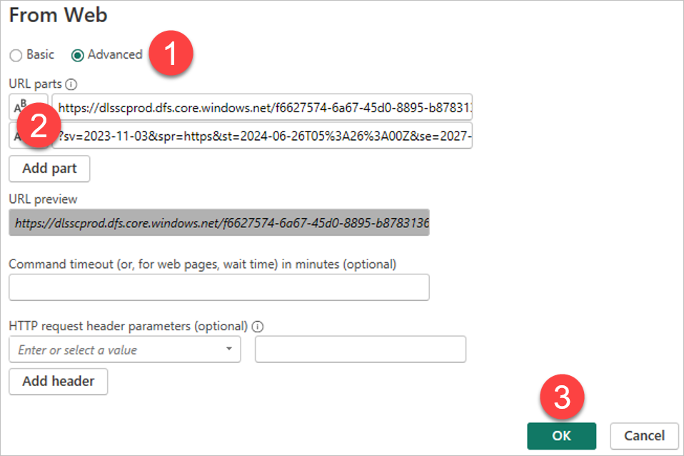
</figure>

6. Then, the information below will display. Select **Ok**.
	
	<figure>
	
</figure>

Below, an example of what your report will look like.

<figure>
	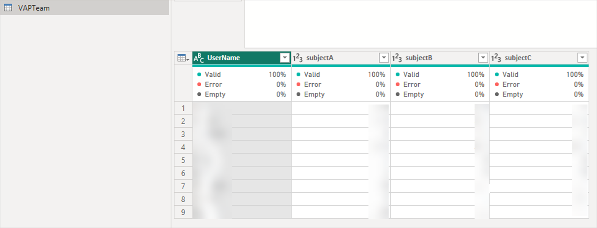
</figure>

**Note that** if you have several files in the File storage, you must repeat all the steps above for each file.

7. Finally, it is time to build your visuals in the report. Save the file in the storage folder of your choice.

⚠️ **If you got the error "Access to the resource is forbidden**, it may be because Power BI is reusing a previously cached, incorrect, or invalid connection string. 

To resolve this, in PowerBI:
1. Go to **File** > **Options and settings** > **Data source settings**.
2. Find the data source that caused the error, right-click it, and select **Clear Permissions**.
<figure>
	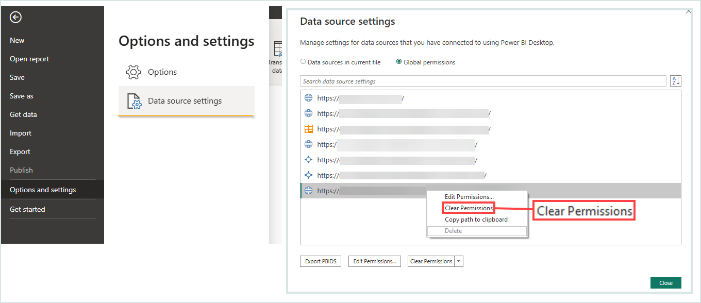
</figure>

3. After clearing permissions, reconnect to the data source by re-entering the correct URL and query parameters when prompted.

## To use an Uploaded structured Data Workbench data set in a VAP report
For uploaded structured datasets from Data Workbench, **do not** use the "Web" data connector in Power BI, because this will result in an empty dataset.

Instead, follow the steps below.

### 1. Connect in Power BI Desktop
1. Open Power BI Desktop.
2. From the **Home** tab, select **Get Data**, then go to **Azure** > **Azure Data Lake Storage Gen2**.
3. In the connection window:
   - For the **URL**, paste the **part of the SAS token before the `?`** (this is the path to the file).
   - Under **Authentication method**, select **Shared access signature (SAS)**.
   - For the **Token**, paste the **part of the SAS token starting from and including the `?`** symbol.

### 2. Load and transform data
1. Once the connection succeeds, Power BI will show you the contents of the data set.
2. Click **Transform Data** to open the Power Query Editor.
3. In Power Query Editor, verify or adjust your data as needed, then click **Close & Apply** to load it into your report.

### 3. Save and upload to VAP
1. Build your visuals as needed and save the file as a `.pbix`.
2. In VAP, upload the Power BI file as a **Resource File**.
3. If the data source shows a connection error (for example, missing token):
   - Click **Edit** on the resource file.
   - Change the **Data Source Sub Type** to `DWB Structured Data Set`.
   - Paste the SAS token into the **Credential** field.
   - Click **Update** to apply the SAS token.
   - Wait for the message **"Update SAS token successfully"** to appear.
   - Click the **refresh** icon next to the source title to validate the connection.
   - Wait for the confirmation message **"Connect to data source successfully."**
   - Then click **Save** to confirm and store the full configuration.

**Remember that the SAS Token** required in the Credential field **is** the same as **the Key generated** for the data set **in Data Workbench**.

### 4. Optional: Enable auto-renew SAS token
If you want the system to renew the SAS token automatically:
1. In the Edit Resource File screen, toggle **Auto Renew SAS Token** to ON.
2. Ensure that both the **Data Workbench Workspace ID** and **Data Set ID** are filled in.
3. Click **Save**.

**Note that** if either the Workspace ID or Data Set ID is missing, auto-renew will not work.

### 5. Optional: Use API to generate token
You can also generate the SAS token using the API. See [With an API call](#with-an-api-call) for full details. You can then copy the token and paste it into the VAP Credential field as needed.

## Use parameter to save access key and URL
You can also use a parameter to save the access key and URL. However, **note that** VAP currently has no user interface for setting the parameter. 

If you still want to use the parameter, follow the steps below.

1. In Power BI Desktop, in the **Home** tab (1), select **Transform data** (2). This will open a dropdown. Select **Transform data** (3).

<figure>
	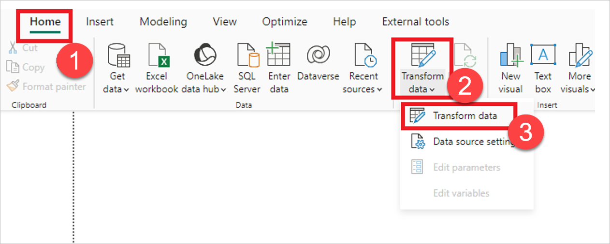
</figure>

2. In Power BI Desktop, in the **Home** tab (1), under **Manage Parameters** (2), select **New Parameter** (3).

<figure>
	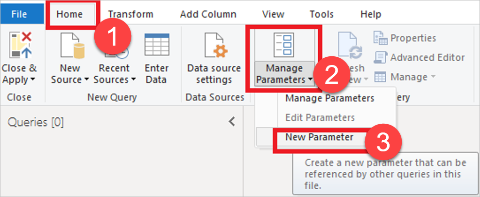
</figure>

3. Under **Name**, enter the name of the new parameter (1). Under **Current Value**, enter the default value (2). When you are finished configuring the parameter, select **Ok** (3). Note that the **Required** property should be checked.

<figure>
	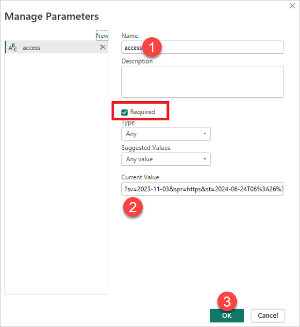
</figure>

4. Now, you can use the parameter which you created before. To do it, in Power BI Desktop, under **From Web**, select **Advanced** (1).
5. Under **URL parts**, select the icon marked in the picture below (2) and select **Parameter** (3).

<figure>
	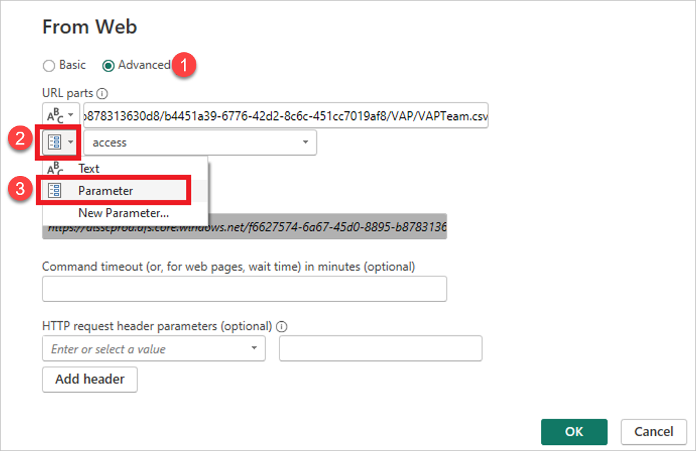
</figure>

## Update data in Data Workbench and refresh file to get new data in VAP

To update a file in Data Workbench, ensure that the file you want to upload has the same name as the old one.

Overwrite the existing file in Data Workbench.

New data will be shown in the report in VAP when a scheduled refresh is set up or you trigger an on-demand refresh from VAP Resources.

## Upload Power BI file in VAP

To upload a Power BI File in VAP, follow the steps below.
1. Open your VAP service.
2. Open Admin Module with Data/Report/System Admin role user. This will open a side menu.
3. From the side menu, select the **+** icon and select **Add Resource File**.

<figure>
	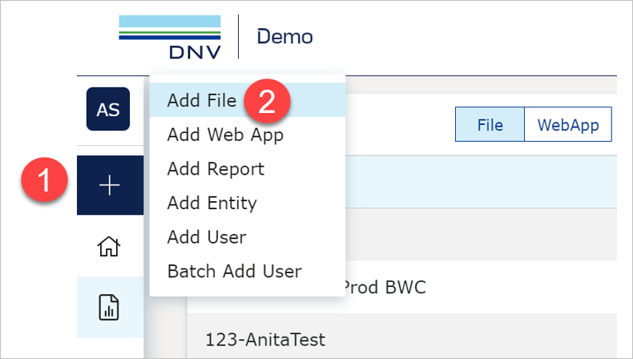
</figure>

4. Fill in the required details and upload your `.pbix` file.
5. If the file uses a **File Storage data set** and this is the **first time** it's added in the current service:
   - Click **Edit** on the uploaded resource.
   - Change the **Data Source Sub Type** from `Web` to `DWB File Storage`.
   - Click **Save**.
   - After saving, the **Credential** section appears.
   - Paste the SAS token (generated in Data Workbench) into the **Credential** field.
   - Click **Update** to apply the token.
   - Click the **refresh icon** to validate the connection.
   - When you see **"Connect to data source successfully"**, click **Save** again.

   > If you skip this step, the token field will not appear and the connection will fail.

6. If the same File Storage data source was previously connected in this service:
   - The saved credential is reused automatically.
   - You must still change the **Data Source Sub Type** to `DWB File Storage` and click **Save**.
   - This ensures VAP correctly identifies the data source type.
   - There is no need to re-enter the SAS token.

7. To update the SAS token later:
   - Click the link or key icon next to the data source.
   - Paste the new token (for instructions how to generate it, see [To generate an access token for a File Storage data set](#to-generate-an-access-token-for-a-file-storage-data-set)).

8. Once the file is connected, select the **+** icon again and choose **Add Report** to register the report in VAP.

For more details, see the [resource management guide](https://developer.veracity.com/docs/section/vap/admin-tab/resource).

## Enable scheduled refresh on report to get fresh data

To learn more about the Refresh Schedule Plan, go [here](../admin-tab/resource.md).

When a scheduled refresh is set on the data in VAP, fresh data from the report is shown at the intervals you have set. 

**Note that** a scheduled refresh will fail if:
* The file does not have the same file structure as before.
* The access key is no longer valid.
* The file was deleted, or the newly uploaded file does not have the same name.

Enable scheduled refresh or demand refresh on your report.

[Next](update-old-data-source.md)