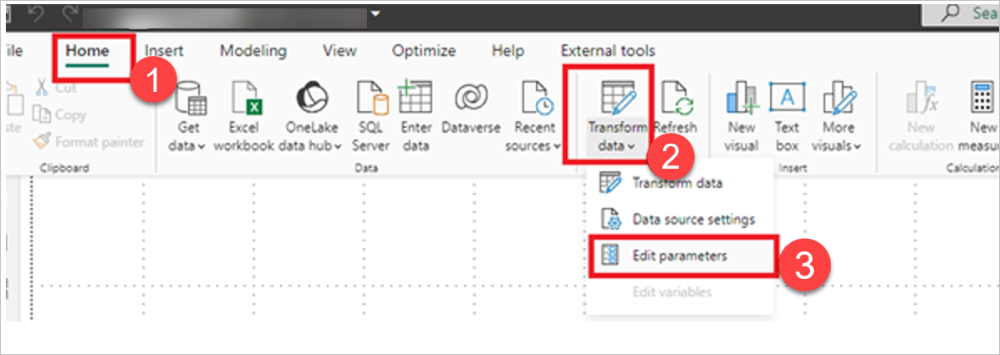
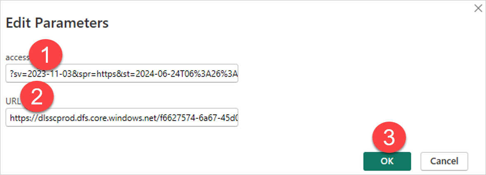

# Update old Power BI file connected to Data Fabric to connect to Data Workbench File storage

Learn how to update your old Power BI file connected to Data Fabric to connect to Data Workbench File storage. If you are creating a new Power BI file, you have nothing to update, and you can skip this page.

Depending on whether you use a Parameter or a URL and access key to contain the Data Fabric source, follow one of the instructions below.

## Update old Power BI file using URL and access key

To update your old Power BI file connected to Data Fabric to connect to Data Workbench File storage using a URL and access key, follow the steps below.

1. Open your old Power BI file with Power BI Desktop.
2. In Power BI Desktop, in the **Home** tab (1), select **Transform data** (2). This will open a dropdown. Select **Transform data** (3).

<figure>
	
</figure>

3. Find the query which uses Data Fabric and select it (1).
4. Then, under **Applied Steps**, next to **Source**, double-click the gear icon (2).
5. Under **URL parts**, in the upper field, enter the new URL (3).
5. Under **URL parts**, in the lower field, enter the access key (4). 
6. Select **Ok** (5).

<figure>
	
</figure>

## Update old Power BI file using parameter

If you use a parameter to contain a Data Fabric source, then, to update your old Power BI file connected to Data Fabric to connect to Data Workbench File storage, follow the steps below.

1. In Power BI Desktop, in the **Home** tab (1), select **Transform data** (2). This will open a dropdown. Select **Edit parameters** (3).

<figure>
	
</figure>

2. Update the parameter context under **access** (1) and **URL** (2).
3. Select **Ok** (3). This will update all queries which use Data Fabric.

<figure>
	
</figure>