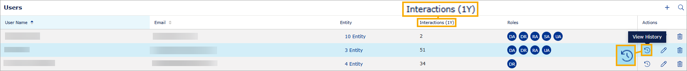
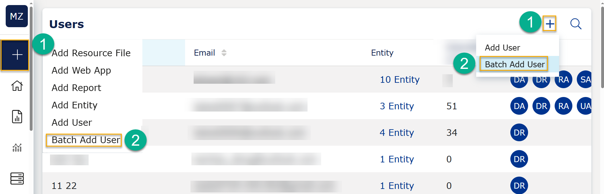

# VAP 4.21 release

Read this page to learn what has changed in the Veracity Adapter for Power BI. 

## New features

### User interaction count in Users list view
On the Users page, a new column **Interactions (1Y)** shows the number of interactions each user has had with the VAP instance within the past year. This provides a quick overview of user activity. Note that this column is not sortable.

For any user, you can see what entities they interacted with and when you select the **View History** icon in the "Actions column" in the row with the user.
<figure>
	
</figure>

### Generate a Public Viewer link (Admin only)
As an Admin user, now you can go to a report with a Public Viewer enabled, and **Generate a link** that can be used to access this report without signing in, which makes it suitable for sharing non-sensitive data with external stakeholders.
<figure>
	
</figure>

As an Admin, if you want to enable or disable Public Viewer: 
1. Go to the **Entitites** page and find the entity for which you want to enable or disable Public Viewer.
1. In the "Actions" column, select the **Edit** icon.
1. Next to **Allow Public View**, toggle it on or toggle it off. When the toggle is off, it is grey and users can't access the entity via URL without signing in.
1. At the right bottom, select the **Save** button to confirm your changes.

### Easier access to "Batch Add User"
Now, for Admins, it is easier to find the  "Batch Add User" option:
* On any page, you can select the plus button (1) on the left and then then "Batch Add User" (2).
* On the **Users** page, you can select the plus icon (1) in the top right corner and then "Batch Add User" (2).

<figure>
	
</figure>