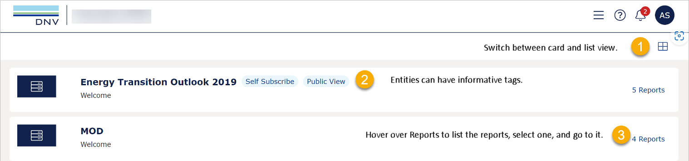
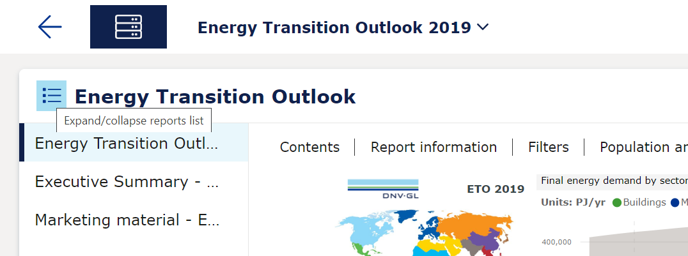

# VAP 4.7 release
Read this page to learn what has changed in Veracity Adapter for Power BI.

This release has brought many visual changes that modernized the UI and made it easier to use including significant improvements for mobile view. In the header and footer, you will find access to other services, support tools, help center, and more.

Below you can see the changes related to tags, report list, and card or table view.

<figure>
	
	<figcaption>The image shows new elements of the VAP Home menu.</figcaption>
</figure>

## Card or table view
In the top right corner, under the question mark and notification icons, you can select the icon to change your view to see your content in the form of cards or as a table.

## Tags

Now, on the Home menu, reports can have tags. For example:
* Self Subscribe - You can share this report with your coworkers and they can immediately access it (provided they register a Veracity account).
* Public View - Is available to everyone.
* Personal Data - Contains personal data.

## Report list

In the row with the report, on the right, you can see how many reports are available inside an entity (for example, "4 reports"). Hover over it to see the list of the reports. To go directly to a report, select it from the list.

## Quickly switch between reports
To switch between reports you are viewing, select the name of the report you are viewing and, from the dropdown that appears, select another one. 

<figure>
	
</figure>

## Collapse or expand
To get more view space, you can select the blue icon next to the report name to collapse the left report section.

To expand the left report section, select the blue icon again.

<figure>
	
</figure>

## Not supported on small screens
Note that the following is not supported on small screens:
* Release and report tutorial
* Share bookmark
* Full screen
* Admin menu
To access these features, use a monitor or laptop.
