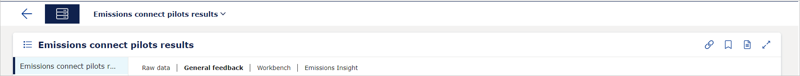
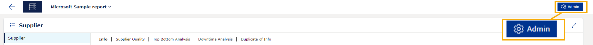
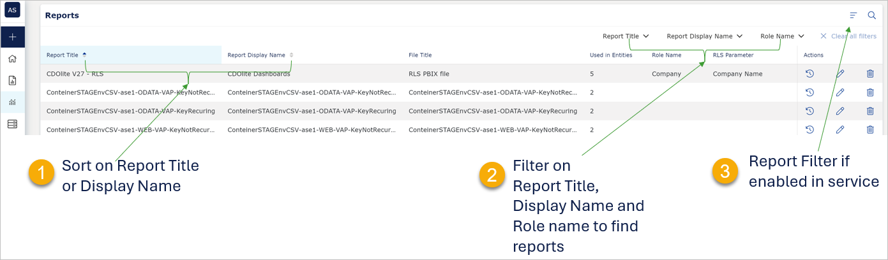

# VAP 4.15 release placeholder

Read this page to learn what has changed in the Veracity Adapter for Power BI. 

**We will update this page before we release VAP 4.15**. For now, this place is a placeholder.

## New Features
This section covers new features.

### Improved admin user interface
We have improved the admin user interface and made navigation easier to provide a better user experience.

### New properties for API consumers
On the **Config** page, in the **Tenant Properties**, we have added the following properties:
* Admin API Consumer
* Embed API Consumer

These properties can have values "Yes" and "No," depending on whether your service is an API consumer.

### Improved security
We have improved the security of your VAP service by implementing Azure Virtual Network, Azure Front Door, and Web Application Firewall.

### Changes in existing features
This section covers changes in existing features.

### Reports redesign
We have redesigned the Reports page, added more sorting and filtering options to reports, and enabled you to see the number of entities to which each report is connected.

You can sort columns with two arrows (1) next to the column name. To sort a column, select its name.

To apply filters to the report list, in the top right corner, select the magnifying glass (2) icon and apply filters.

The number of entities connected to a report is shown in the **Used in Entities** column (3).

<figure>
	
</figure>

### Admin button on report pages
Now, admin users can go directly from viewing a report to their Admin pages which shortens the navigation and improves user experience.

Previously, when you opened a report, you didn't see the Admin button:
<figure>
	
</figure>

Now, if you are a VAP admin, the Admin button shows in the top right corner of the page with the report, and you can use it to navigate to the Admin panel.
<figure>
	
</figure>

### Sort and filter in Reports
Now you can do the following in Reports:
* Sort Report Title and Report Display Name (1).
* Filter Report Title, Report Display Name, Role Name (2).
* Use Filters in Reports if they were enabled in the VAP service (3).

<figure>
	
</figure>