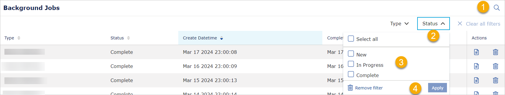
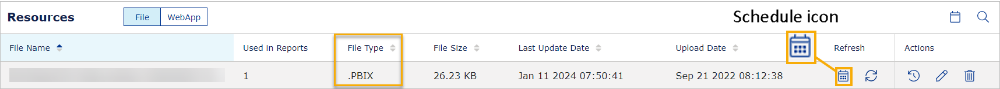
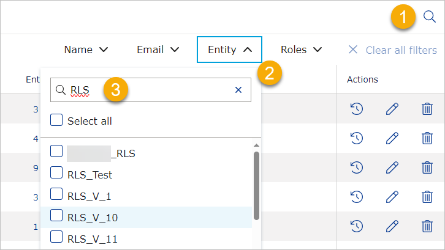

# VAP 4.13 release

Read this page to learn what has changed in the Veracity Adapter for Power BI. 

## New Features
This section covers new features.

### Can filter on Home and Background Jobs

In the previous release, we added filtering for Resources and Users. Now, you can also use filters on the following pages:
* Home
* Background Jobs

To filter:
1. In the right corner, select the magnifying glass icon.
2. Select a filter.
3. Select filter settings.
4. Select the **Apply** button.

<figure>
	
</figure>

### Added Refresh Schedule Plan in Resources
Now, Data Admins and Report Admins can access Refresh Schedule Plans on the Resources page and plan when the reports they uploaded should be refreshed.

To schedule refresh plans for reports:
1. In the top right corner of Resources > File, select the schedule icon.
2. In the panel that appears, **Add** a new plan, **Edit** an existing plan, or **Delete** a plan.

When you have scheduled a refresh plan, you can apply it to reports.

<figure>
	
</figure>

To apply a refresh plan to a file:
1. In the row with a Power BI report (File Type must be .PBIX), in the **Refresh** column, select the schedule icon.
2. Under **Select a Schedule Plan**, select a Refresh Schedule Plan.
3. In the bottom right corner of the panel, select **Save**.

<figure>
	
</figure>

## Changes in existing features
This section covers changes in existing features.

### Text search for Entities in Users
We have improved filtering for Entities on the Users page, adding a text search option. To use it:

1. In the right corner, select the magnifying glass icon.
2. Select **Entity**
3. Start typing the name of the entity. The list of entities you can select will show only those with matching names.

<figure>
	
</figure>

### Background Jobs redesigned

The Background Jobs page was redesigned to improve user experience. 

### Removing background jobs
Now, only the Admin user who created the job or the System Admin role can delete background jobs.

### Removed Refresh Schedule Plan from Configure
We removed the option to schedule a report refresh plan from the Configure page, where only System Admins could access it. Now, it is on the Resource page, where Data Admins and Report Admins can also use it.