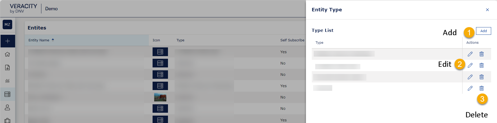
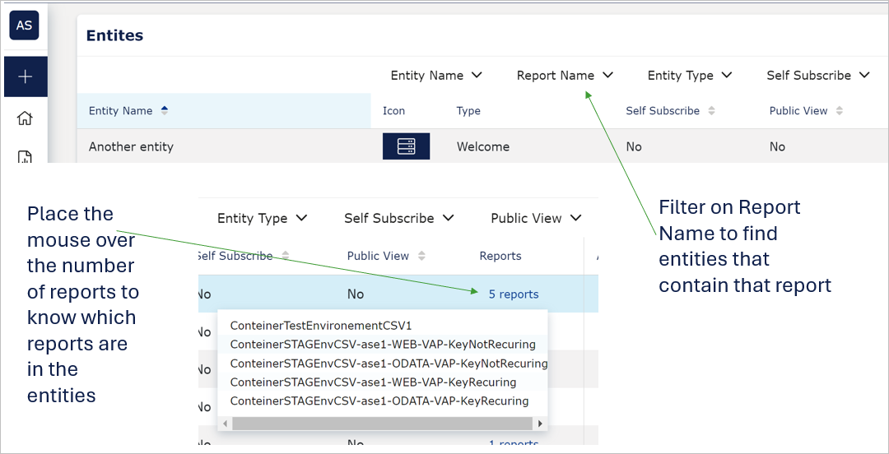
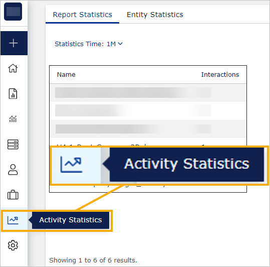
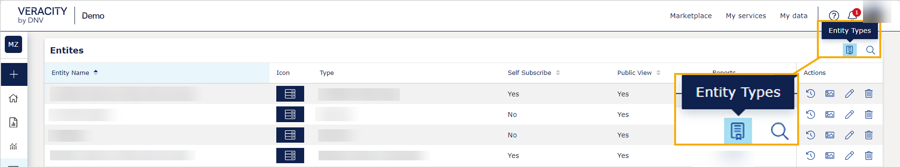

# VAP 4.14 release

Read this page to learn what has changed in the Veracity Adapter for Power BI. 

This release brings significant quality improvements. We've redesigned the **Entity** and **Config modules** in the Admin Panel, enhancing their functionality. We've also improved the message when the subdomain is incorrect, making it easier for you to troubleshoot.

## New Features
This section covers new features.

### Manage entity types
When you go to the Entities tab and select Entity type in the top right corner, you can do the following with entity types:
* Add (1)
* Edit (2)
* Delete (3).

<figure>
	
</figure>

### New filters in Entities
Now, you can use the Report Name filter to filter for entities containing a report with a matching name. For help on how to apply filters, go [here](../admin-tab/overview.md).

Also, now you can hover over the number of reports in an entity to see the reports that are stored within this entity.

<figure>
	
</figure>

## Activity Statistics
As a System Admin or Data Admin, you can access the Activity Statistics tab to see statistics for reports and entities. 

<figure>
	
</figure>

## Changes in existing features
This section covers changes in existing features.

### Entity type moved to Entities
Previously, as a SytemAdmin, you could access Entity types in the Config tab. Now, we have moved them to a tab that is also accessible for Data Admins so that they can manage entity types independently.

Now, you can access entity types in the top right corner of the Entities tab, as shown below.

<figure>
	
</figure>

### Redesigned the Config tab
Previously, the Config tab contained functionalities that different admin types could use. We have redesigned it to show only what System Admin users can do.

As a part of this redesign, we have moved the functionalities accessible to Data and ReportAdmin to other locations where they can easily find them. Another part of the redesign was creating the following categories and putting relevant information in them:
* Statistics Report
* Tenant Properties
* Tenant Documents
* Header & Footer

Note that **Workspace ID** is available in the Config tab in the Tenant Properties category.