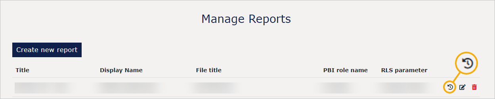
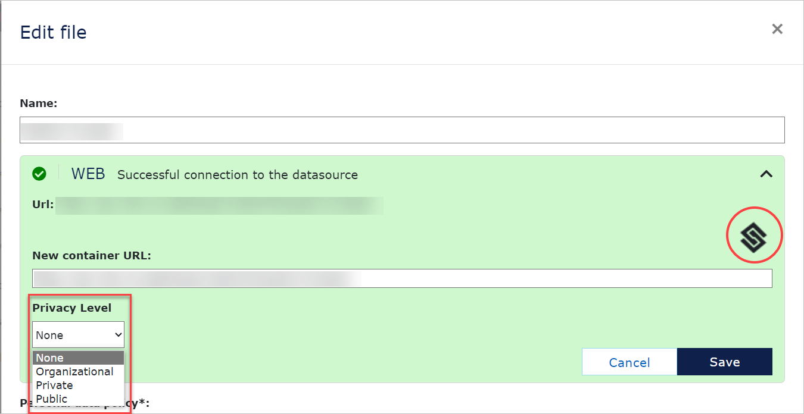

# VAP 4.8 release
Read this page to learn what has changed in Veracity Adapter for Power BI.

## New features
This section covers new features.

### Statistics for reports and entities
In the Admin panel, we have added a tile called "Statistics". There, you can see usage statistics for your reports and entities in a selected time period. To see details, you can select an element you want to check. For example, you can select a column or a pie chart to see detailed statistics related to it.

### User statistics
Now, in the Admin panel in Manage Users, for each user, you can check the number of their interactions with your entities  (year to date) and what they looked at. To do so, in the row with the user's name, select the icon shown below.

<figure>
	
</figure>

### Entity statistics
Now, in the Admin panel in Manage Entities, for each entity, you can see when it was accessed from the Home menu and by whom. You can also see the number of interactions with the entity (year to date). To do so, in the row with the entity, select the icon below and then select the **User Visit History** tab in the pop-up window that opens.

<figure>
	
</figure>

### Report statistics
Now, in the Admin panel in Manage Reports, you can see who and when interacted with the report for each report. You can also see the number of interactions with the report (year to date) and the entity that was used. To do so, in the row with the entity, select the icon below and then select the **User Visit History** tab in the pop-up window that opens.

<figure>
	
</figure>

### Privacy level on dataset and data sources
Now, when you go to Admin panel > Manage Files and upload a file using the "Upload file" button, you can set the **Privacy Level** for all data sources used in the report.

There are the following privacy levels:
* None - Before this release, it was the default setting.
* Organizational
* Private
* Public

For details on privacy levels, go [here](https://learn.microsoft.com/en-us/power-bi/guidance/powerbi-implementation-planning-security-content-creator-planning#privacy-levels).

Note that privacy levels set in Power BI Desktop are **not transferred** during the upload. However, after uploading the report, you can set data privacy for each data source separately.

#### For organizational privacy level
Suppose the privacy level in Power BI Desktop data source is organizational. In that case, you must also set it on the data source in your service to avoid issues with refreshing the data source. For details, go [here](https://learn.microsoft.com/en-us/power-bi/guidance/powerbi-implementation-planning-security-content-creator-planning#privacy-levels).

#### To set a privacy level for a data source

To set a privacy level for a data source, in the Admin Panel > Manage Files, in the row with the name of the report:
1. Select the editing icon.
2. Select the **Load datasource status** button.
3. Select the icon shown below.
4. For each data source, under **Privacy Level**, select a privacy level.

<figure>
	
</figure>

## Changes in existing features
This section covers changes in existing features.

### Show Report Page Menus moved

Now, all settings related to reports are in the Admin Panel in "Manage Reports". Note that there was no change in the settings in your reports.

### See entire entity names in Public Viewer
Now, in [Public Viewer](https://developer.veracity.com/docs/section/vap/admin-tab/manage-entities), you can see whole entity names.
