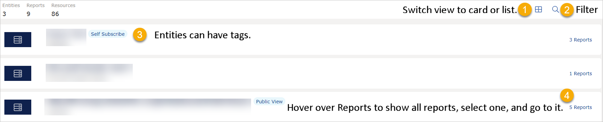
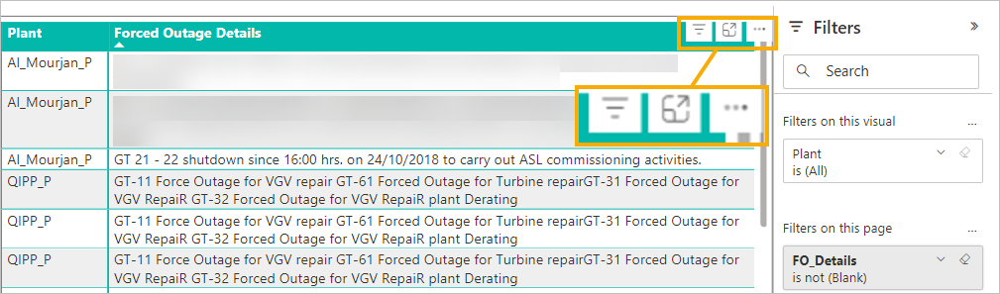
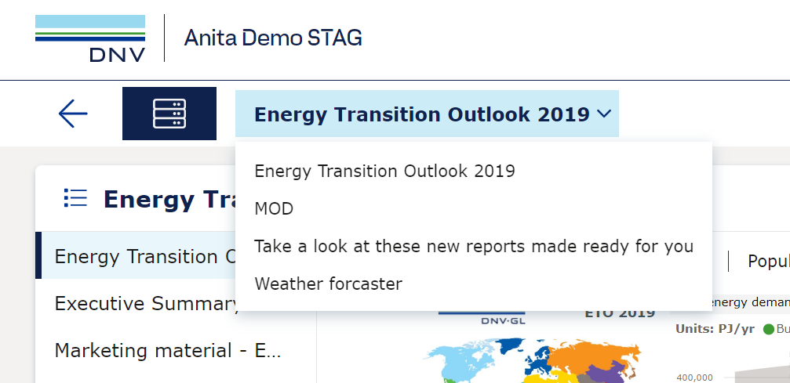
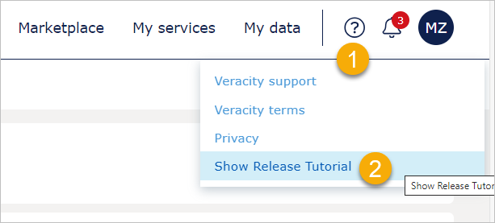

# Overview

This page explains how to access and read reports in Veracity Adapter for Power BI (VAP).

## To access VAP

To access your VAP service:
1. Go to the [Veracity page](https://www.veracity.com/).
2. In the top navigation menu, select ["My Services"](https://services.veracity.com/).
3. Find the tile with the name of your VAP service and select it.

## Home tab

The Home tab of your Veracity Power Adapter for Power BI (VAP) shows the entities you have access to and the reports in them. 

Here, you can:
1. Switch between card and table view.
2. Filter entities by their name or type.
2. See informative tags. For example, "Self Subscribe" for entities joinable for everyone with a Veracity account or "Public View" for entities that can be seen without signing into a Veracity account.
3. See how many reports are included in an entity and navigate to any of the reports.

<figure>
	
</figure>

## Reading reports

### Action icons for all reports
For each report, in the top right corner of the window, you can see some of the following icons:
* "Generate a link" - Select it to see the URL to the report. To copy it, select the **Copy to clipboard** button.
* The bookmark icon - Add bookmarks, share them, and navigate to available bookmarks. For details, go [here](bookmarks.md).
* Tenant documents - Documents related to this tenant, for example, background information giving context to the report.
* "Full screen" - Shows the report in the full screen mode.
* Export - Export the report as a PDF or PPT.
* The attached files icon - After selecting it, shows a dropdown with the files attached to the report. To see a file, select it from the dropdown.

Note that what icons are available and in which order depends on the report author.

### Actions icons for report elements

After opening a report, you can read it and interact with its elements by, for example, filtering values, showing charts as tables, spotlighting an element, and so on. To see available actions for an element, hover over it and watch for icons that will appear above this element, on the right. Note that the available actions depenend on the report author.

<figure>
	
</figure>

## Switch between reports
To switch between reports you are viewing, select the name of the report you are viewing and, from the dropdown that appears, select another one. 

<figure>
	
</figure>

## Collapse or expand left sidebar
To get more view space, you can select the blue icon next to the report name to collapse the left report section.

To expand the left report section, select the blue icon again.

<figure>
	
</figure>

## Not supported on small screens
Note that the following is not supported on small screens:
* Release and report tutorial
* Share bookmark
* Full screen
* Admin menu
To access these features, use a monitor or laptop.

### See a tutorial again
Some reports have tutorials or release notes that show when you open them for the first time.

For all [user roles](../user-roles.md), to see a tutorial for a report again:
1. Open a report with a tutorial.
2. In the top bar, on the right, select Support (the question mark icon).
3. Select **Show Release Tutorial**.

<figure>
	
</figure>

