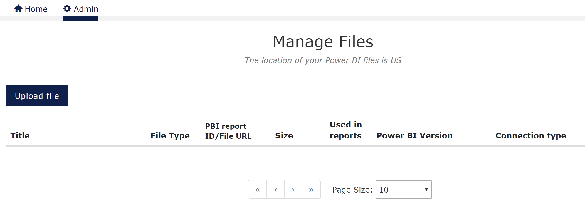

# Upload your files
[Previous - How to set up your service](2-how-to-set-up-your-service.md)

We will now start by looking at the <i>Manage Files</i> feature, and explain all the bits and pieces.

## Manage files
The Manage Files section is all about loading your local files into the VAP solution. In most cases, this is where you start, as most other feature depends on the existence of these files. The file types supported are Power BI files (.pbix), PDF's and some image file types (.png .jpeg and .gif). 

<figure>
	
	<figcaption>VAP Manage Files list view</figcaption>
</figure>
In this view, you have a list of all the files currently referenced in your VAP service, across all project. The Power BI files themself are not stored within VAP but securely stored within the Microsoft Power BI capacity. From this list view, you may also delete files, which will remove them from the view and trigger removal from the Microsoft storage associated with your service.

### Upload file 
By clicking the Upload file button, you will get the following view;

<figure>
	
	<figcaption>VAP - upload a new file</figcaption>
</figure>
The first item is where you chose your file. You can select the file from anywhere available from your file browser. The supported files are Power BI files (.pbix), PDF's and some image file types (.png .jpeg and .gif). 

You are responsible for ensuring that you are allowed to use the data included in the files in the way you are intending, and there are additional details on this in the terms shown during upload.  

Next is the <i>name</i>. The name you define here is for your use as an admin in the menu systems only. Use names that uniquely identifies the file you are uploading.

The <i>connection type</i> is required if the data in the Power BI files are not stored within the .pbix file themself. This would e.g. be if you use SQL DB connection to your Power BI report, or you pull the data from Veracity Data Fabric.

The final setting is the <i>Show Report Page Menues</i>, where you select whether or not the report page menus are shown to the end customers. 

Finally, you can click save, and the file with metadata will be loaded into the VAP service. When doing so, be aware that .pbix files may be of considerable size, and dependent on your ISP provider, traffic on VAP servers and more; the upload may take some time.

### Manage files
In the list view all files in your service are listed. 
<figure>
	
	<figcaption>VAP - File list view with one file listed</figcaption>
</figure>
In the list view, all files in your service are listed.  The main things to note are the title, the Used in reports, Power BI Version, and Connection type. 

- Title: This is the Name you define during upload of a file. It is also the reference you will see when connecting files to reports etc.
- Used in reports: The number represents how many reports where this exact file are in use. When managing file updates, this is an important number to keep your eyes on.
- Power BI version: here the version number of the .pbix files will be shown. "Current" would represent the latest stable version released by Microsoft.
- Connection type: Here, you at a glance, could see how data is loaded into your reports at runtime. When empty, the data is in the report. If SQL, Veracity Data Fabric etc., this will be stated.

The final item in the rows is the delete button. It may be wise to note that "Used in reports" are 0 if you intend to delete a file.

Now, lets learn how to mange your reports.

[Next](4-manage-reports.md)

