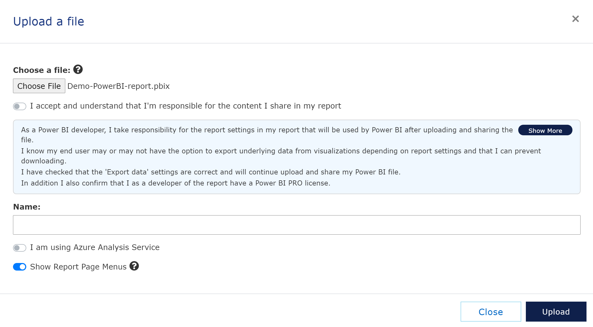

# Upload your files
[Previous - Introduction](1-introduction.md)

We have created a demo file for you to use during this tutorial, and you can download the latest version here:

<a href="./assets/Demo-PowerBI-report.pbix" Download>Demo-PowerBI-report.pbix</a>

## Upload the demo file
First, you go to the admin tab on the menu bar in VAP. Click on the Manage files, and then Upload File.

Fill in the fields, as shown in the image below. When done, click the next button.
<figure>
	
	<figcaption>Step-by-step guide: Upload file</figcaption>
</figure>

You should now have loaded the demo file into VAP, and ready to proceed to the next step.

## Use data container as data source
 <a href="../veracity-container-as-data-source/introduction.md" target="_blank"> Read the guide</a> on how to use Veracity container as data source.  

Now, lets learn how to mange your reports.

[Next](3-manage-reports.md)
