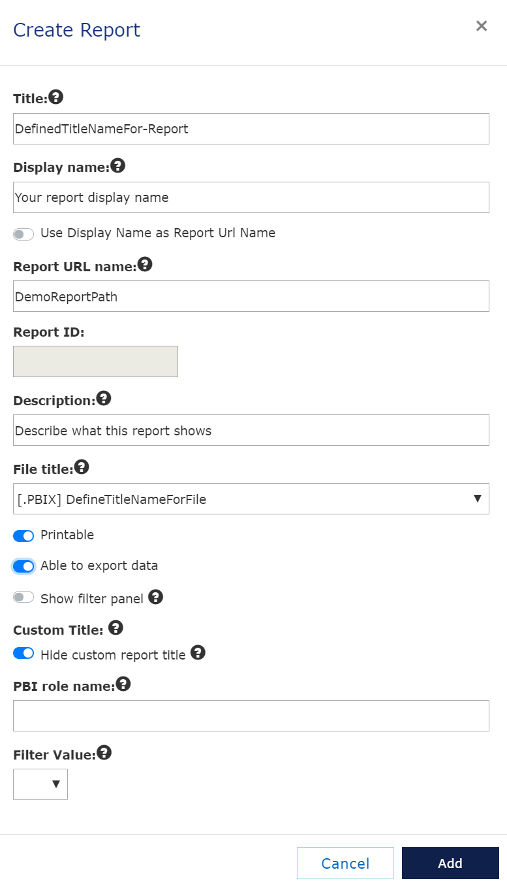

# Manage reports
[Previous - Manage files](2-manage-files.md)

You have now loaded a Power BI file into the VAP service, and you are ready to create the logical report. In this process, we will also connect the uploaded file to this logical report. 

Enter the <i>Manage Reports</i> section, and click <i>Create New Report</i>. Then, fill in the fields as shown.

<figure>
	
	<figcaption>Step-by-step guide: Create Report</figcaption>
</figure>

Click add, and you have created the logical report and made the necessary connection to a .pbix file.

Now, lets set up entities.

[Next](4-manage-entities.md)

