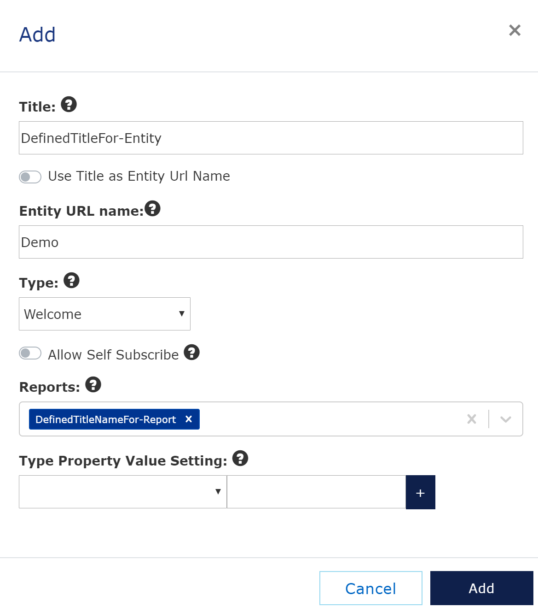

# Manage Entities
[Previous - Manage reports](3-manage-reports.md)

You have now connected a file to a logical report and getting close to granting users access. Users are granted access to entities. An entity is like a book, where each chapter is a logical report. For you, an entity may then be a project, an asset, a client or a product. In this case, we just call it a project.

Enter the <i>Manage Entities</i> section, and click <i>Add</i>. Then, fill in the fields as shown.
<figure>
	
	<figcaption>Step-by-step guide: Add an entity</figcaption>
</figure>

Click <i>Add</i> and we are almost done. We are now ready to add users.

[Next](5-manage-users.md)

