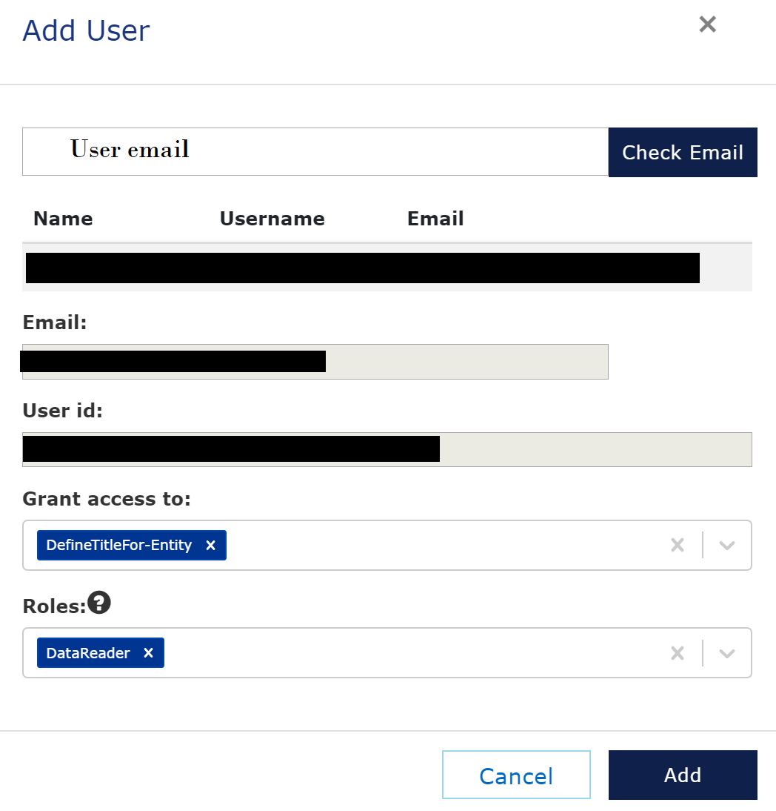
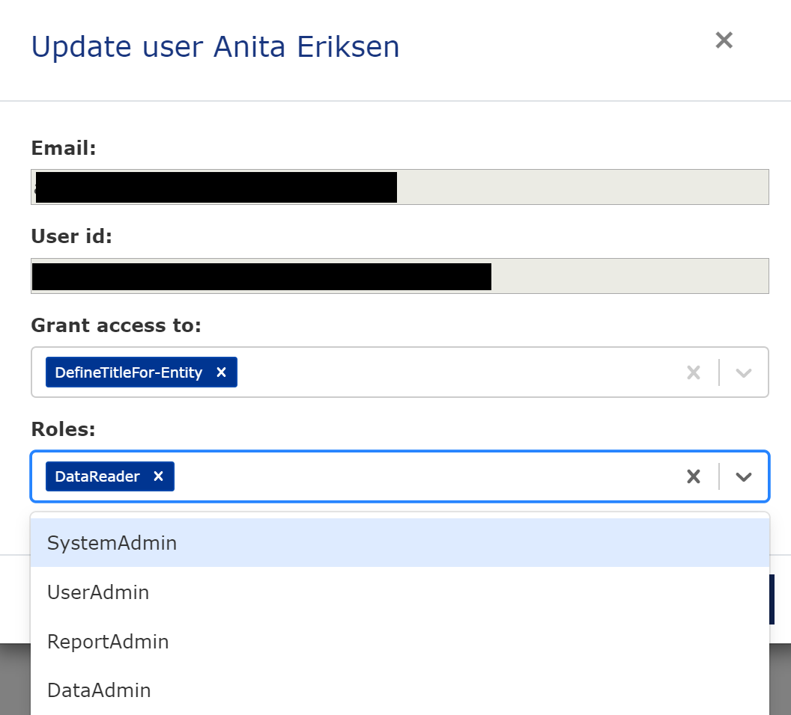
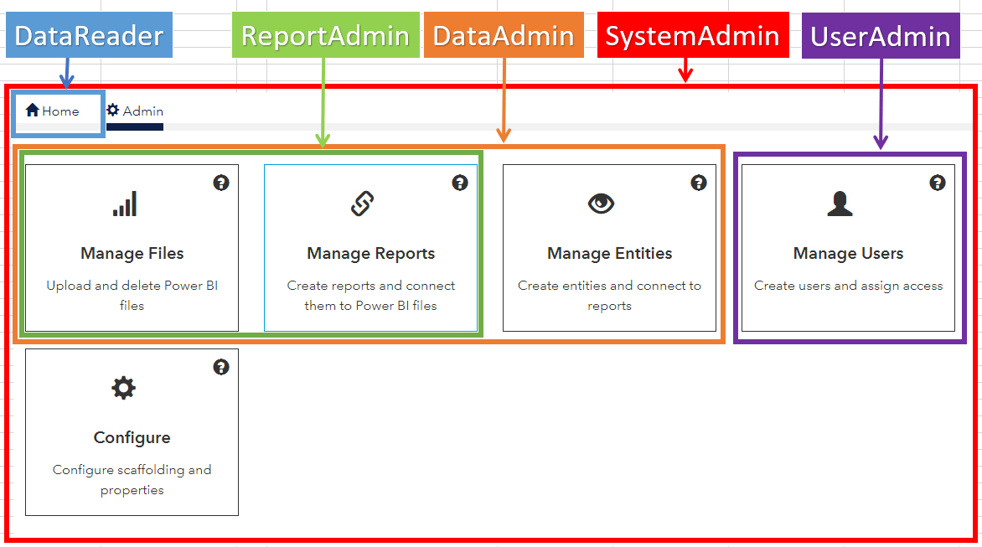

# Manage Users
[Previous - Manage entities](4-manage-entities.md)

										
Now we are very close to granting users access. Drop into the Manage Users section, and we can start adding them. There are two main usecases; first, the grant customers access, and second, adding collaborators with elevated access rights within your VAP service. We will do both.

## Add customers
To add a customer to your service, click the <i>Add user</i> button and type in the email of the user. Click <i>Check email</i> to verify the user account. If the user doesn't have a Veracity account, you will need to use the built inn invite function. See the user manual for details.

Fill in the fields as follows, but with the email as of your preference. 
<figure>
	
	<figcaption>Step-by-step guide: Add user</figcaption>

You have now granted access to the customer, and they will be able to see the report you uploaded and configured. 

From the list view in the Manage users, you can see that users are granted access to entities individually. They are also granted access level on service level. We will do this next.

## Add collaborators
We will now add a collaborator. Note that you are now about to grant access to your VAP service admin functionality. Do <i>not</i> give this access to your customers.

Add a new user, or if the user you are about to grant access to is already added, click the edit button in the list view. The go to the <i>Roles</i> dropdown and have a look at the possible roles.
<figure>
	
	<figcaption>Step-by-step guide: Add collaborators</figcaption>
</figure>
The highest user access level is the SystemAdmin. The SystemAdmin have access to all Admin functionality. The other roles have access to parts of the Admin interface, as shown below.
<figure>
	
	<figcaption>Step-by-step guide: Role description</figcaption>
</figure>

You have now granted users access and added collaborators. Let's summarize and have a look at whats important to do next.

[Next](6-summary.md)

