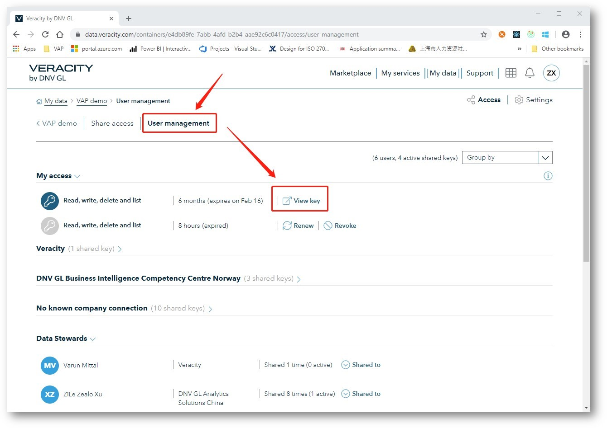
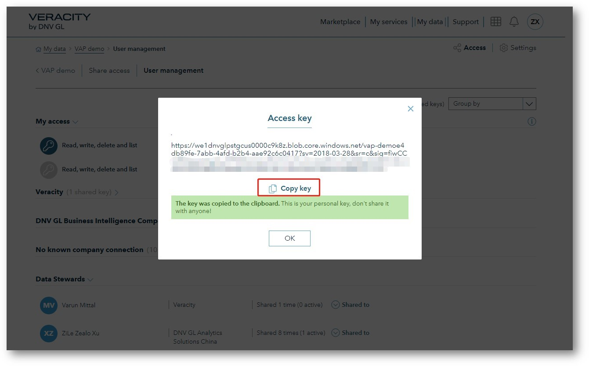

# 3.	FOR VERACITY CONTAINER THE FILE URL NEEDS TO BE USED IN YOUR POWER BI REPORT

You will later use the key when building the report from Power BI Desktop. 

## 3.1	First, we need to find the key
Click User management, then click “View key” to copy your key. 

<figure>
	
</figure>

<figure>
	
</figure>

The key you copied contains 3 parts 
1.	Resource part: https://we1dnvglpstgcus0000c9k8z.blob.core.windows.net  
2.	Container part:  /vap-demoe4db89fe-7abb-4afd-b2b4-aae92c6c0417
3.	Key part: ?sv=2018-wCCK7E5WgdTJqby7KPNNkw6gxKVzSmerSw4w…………………

## 3.2	Second you need to add the filename and path into the key
Now we have the key to the container. But to build a Power BI report you also need the filename to your data source. Please add / type your file name and path into the key. In our example the filename is myContainerData.csv and the folder name simply is just Folder.

So the file URL to be used in your Power BI Desktop when building your report should consist of: Resource part + Container part + Folder + filename + key

The correct file URL is: https://we1dnvglpstgcus0000c9k8z.blob.core.windows.net/vap-demoe4db89fe-7abb-4afd-b2b4-aae92c6c0417<b>/Folder/myContainerData.csv</b>?sv=2018&sr=c&sig=fiwCCK7E5WgdTJq...................
Please note the URL is case-sensitive.

[Next](4-create-powerbi-report.md)