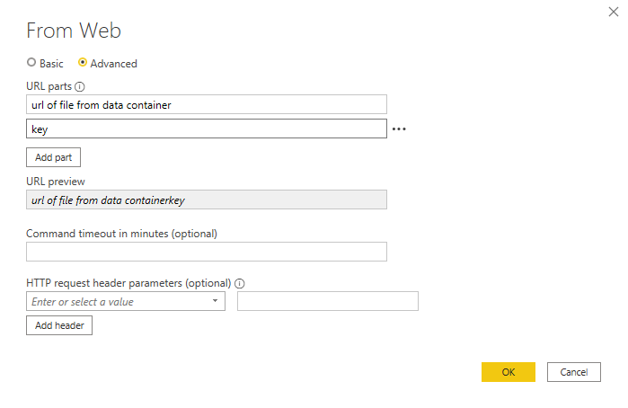
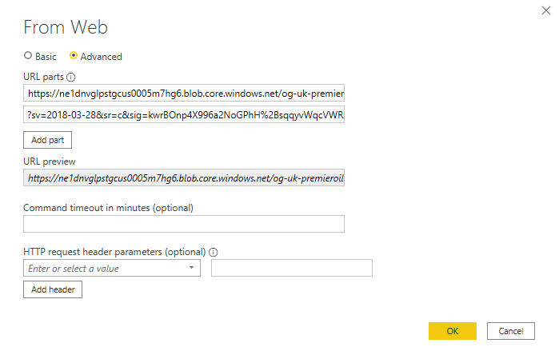
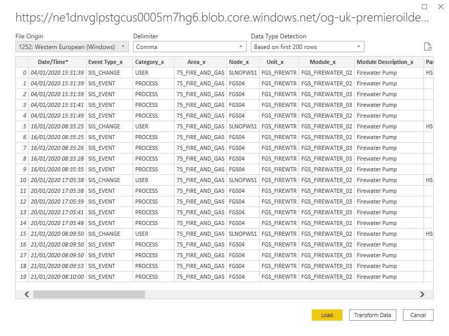
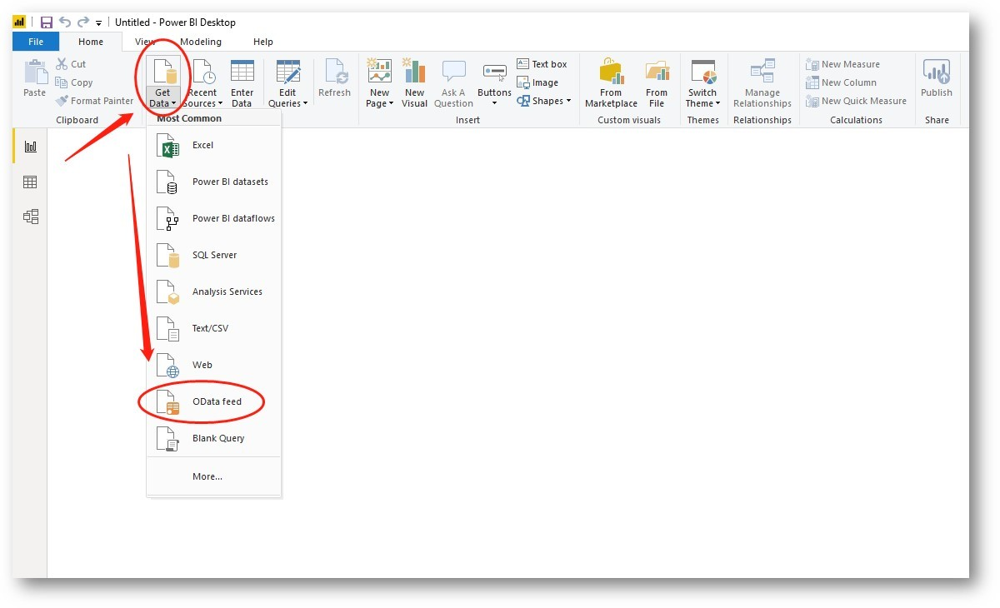
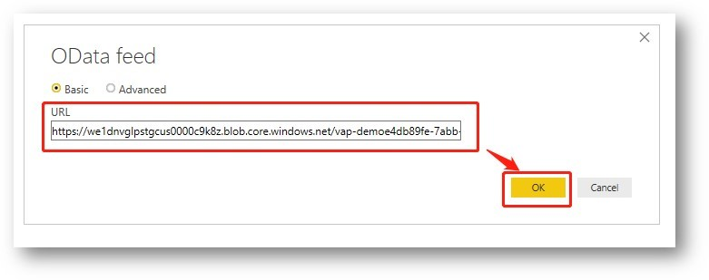

# 4: CREATE YOUR POWER BI REPORT USING THE FILE URL

Go to Power BI Desktop to create your report.

There are two ways to connect to a Veracity data source when building a power BI report. You can select either ‘Web’ or use ‘OData feed’. This section will describe what to do for both cases. Both alternatives require workaround actions due to limitations from Microsoft, but both ways let you connect to the data in the container, renew the access key and set up scheduled refresh to refresh the data in the Power BI report. 

## 4.1	Get data from ‘Web’ is the recommended way
The Veracity container have limitation on how long the Veracity container can be valid. Max 6 month. The current limitation from Microsoft is that the data source information stored in your Power BI file can only be changed if you define a Parameter when building your report in Power BI. Because of this we must do some workaround steps as described here.

<figure>
	
</figure>

Select the menu ‘Edit Queries’ to define your parameter.

The next selection is ‘Manage Parameters’ - select ‘New Parameter’. Define a Parameter and add the file URL in the field named ‘Current Value’. How to find the file URL is described in section 3. You can give the parameter a name of your choice, preferably something that describes the content of the file as it will be the default name on your data table. Set other options as in below image.

<figure>
	
</figure>

**Note** : For top level items Veracity automatically includes a content folder “/content/” this text field must be removed for files to be located by Power BI.

<figure>
	
</figure>

<figure>
	
</figure>

Click ‘ **Load’** .

Then save your parameter and click ‘Close & Apply’.

If you have several files in the container you must repeat all these steps for each file.

## 4.2	Get data from OData Feed 

Click Get Data in Home panel, then select OData feed. If you cannot find it, please click More… 

<figure>
	
</figure>

Paste the file URL into the URL area. 

<figure>
	
</figure>

It’s successfully set up if you can see the data shown. Please click Load on the data to be used. 

<figure>
	
</figure>

### 4.2.1	There are two issues if you use OData  
There are two issues if you use OData when you create your Power BI report, and you must do some workaround to get it to work. 
1.	When using OData feed the file cannot have above 2000 rows of data.
2.	When using OData feed the file content type cannot be text or csv
On issue 2 comes the current Veracity Container limitation into play. You cannot change the file content type when uploading a file into your Veracity container. That’s why we must do some workaround steps as described here.
#### 4.2.1.1	OData feed the file cannot have above 2000 rows of data
If your file has more than 2000 rows of data, you must use the WEB way.
This is the answer VAP team receives from Microsoft support 7th May 21: <i>As verified by the product department, the CSV file stored in Azure Blob Storage is not within the scope of the Odata connector. It is recommended to use the web connector instead.</i>

In the answer from Microsoft they write ‘Azure Blob Storage’ this is what we in this document refer to as Veracity Container.

#### 4.2.1.2 Change file content type

Open Microsoft Azure Storage Explorer to check your file. If the Content Type is not **application/octet-stream** , it must be modified. Please click the file, then select Properties. From the example below you see the content type is text/csv and how to modify it.

<figure>
	
</figure>

Change to application/octet-stream, then click Save button.

<figure>
	
</figure>

## 4.3 Build your visuals and save the file as usual

Finally, it is time to build your visuals in the report. Save the file to your favorite storage folder as a .pbix file.

[Next](5-upload-report.md)